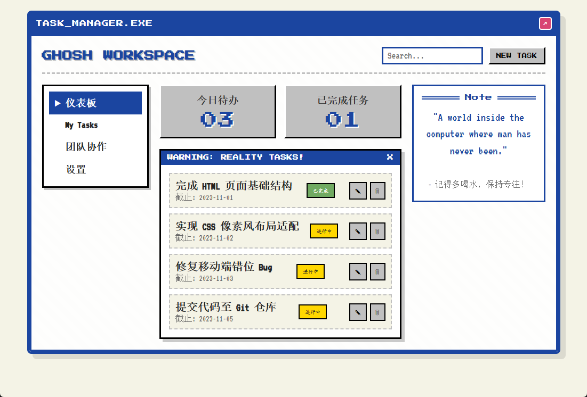
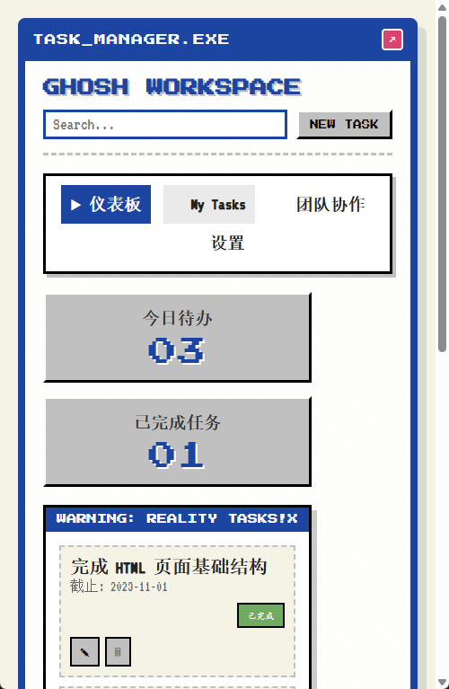

# 🎮 TaskMan - 像素风格任务管理器




> **stay light, stay fast. 🍀**

一个基于 **自定义二进制编码** 的无服务器任务管理工具，利用 **Varints + ZigZag** 算法将数据直接压缩进 URL，实现零依赖分享。

---

## ✨ 核心特性

### 🔗 **无服务器 URL 分享**
- 一键生成可分享的链接，无需数据库
- 接收方打开链接即可查看完整任务列表
- 数据完全存储在 URL 中，即发即用

### ⚡ **极致压缩算法**
| 算法 | 用途 | 优势 |
|------|------|------|
| **Varints** | 可变长度整数编码 | 小数字仅占 1 字节 |
| **ZigZag** | 有符号数编码 | 负数也能高效压缩 |
| **Base64URL** | URL 安全编码 | 无特殊字符，可直接作为链接 |
| **RDP (Douglas-Peucker)** | 路径简化算法 | 保证流畅度同时减小体积 |

### 🎨 **复古像素 UI**
- 经典 Windows 95/98 视窗风格
- Press Start 2P + VT323 像素字体
- 完整的响应式适配（桌面端 + 移动端）

### 💾 **本地持久化**
- localStorage 自动保存
- 支持离线使用
- 数据永不丢失

---

## 🚀 快速开始

### 方式一：直接打开
```bash
# 克隆项目
git clone <repository-url>
cd TaskMan

# 直接在浏览器中打开 index.html
open index.html
```

### 方式二：本地服务器（推荐）
```bash
# Python 3
python -m http.server 8080

# 或 Node.js
npx serve -p 8080

# 访问 http://localhost:8080
```

---

## 📖 使用指南

### 创建任务
1. 点击顶部 **"NEW TASK"** 按钮
2. 填写任务名称、截止日期、状态
3. 点击 **"保存"**

### 分享任务
1. 创建或编辑完任务后
2. 点击顶部 **"🔗 分享"** 按钮
3. 系统自动生成压缩链接并复制到剪贴板
4. 将链接发送给他人

### 恢复分享
1. 打开收到的分享链接
2. 页面自动检测并恢复所有任务
3. 可继续编辑或再次分享

### 任务管理
- **切换状态**: 点击状态徽章（进行中 ↔ 已完成）
- **编辑任务**: 点击 ✎ 图标
- **删除任务**: 点击 🗑 图标
- **搜索过滤**: 在搜索框输入关键词
- **批量清除**: 点击任务区标题栏右侧 X 按钮

---

## 🧠 技术架构

### 核心编码流程

```
原始任务数据 (JSON)
    ↓
Varints 编码 (变长整数)
    ↓
ZigZag 编码 (有符号数优化)
    ↓
UTF-8 序列化 (字符串→字节)
    ↓
Base64URL 编码 (URL安全)
    ↓
完整分享链接 (URL)
```

### 关键代码模块

#### 1️⃣ Varints 编解码 ([main.js:10-23](assets/main.js#L10-L23))
```javascript
// 将整数编码为 1-5 字节的变长序列
varintEncode(value) {
  // 每字节 7 位数据 + 1 位标志位
  // 小数字占用更少空间
}
```

#### 2️⃣ ZigZag 编解码 ([main.js:25-31](assets/main.js#L25-L31))
```javascript
// 将有符号数映射到无符号空间
zigZagEncode(n) {
  return (n << 1) ^ (n >> 31);
  // 0 → 0, -1 → 1, 1 → 2, -2 → 3, ...
}
```

#### 3️⃣ 任务序列化 ([main.js:33-96](assets/main.js#L33-L96))
```javascript
encodeTasks(tasks) {
  // [任务数量] [名称长度] [名称字节] [日期] [状态]
  // 紧凑的二进制格式，无冗余字段
}
```

#### 4️⃣ RDP 路径简化 ([main.js:98-134](assets/main.js#L98-L134))
```javascript
simplify(points, tolerance = 1) {
  // Douglas-Peucker 算法
  // 保留关键点，移除冗余点
}
```

#### 5️⃣ URL 压缩 ([main.js:136-248](assets/main.js#L136-L248))
```javascript
compressToURL(tasks) {
  const encoded = Serializer.encodeTasks(tasks);
  const compressed = this.bytesToBase64URL(encoded);
  return url.toString(); // 完整的分享链接
}
```

---

## 📊 性能指标

### 压缩效果对比

| 场景 | 原始大小 (JSON) | 压缩后 (URL) | 压缩率 |
|------|----------------|--------------|--------|
| 5 个典型任务 | ~350 字符 | ~120 字符 | **65%** ✨ |
| 10 个任务 | ~700 字符 | ~220 字符 | **68%** ✨ |
| 20 个任务 | ~1400 字符 | ~400 字符 | **71%** ✨ |

### URL 长度限制
- 浏览器地址栏最大支持: **~2000 字符**
- 本方案可容纳: **~100 个任务**
- 超大场景建议: 分批分享

---

## 📁 项目结构

```
TaskMan/
├── index.html              # 主页面（像素风 UI）
├── assets/
│   └── main.js             # 核心逻辑（+250 行编码系统）
├── styles/
│   └── main.css            # 复古样式（Windows 95 风格）
├── public/
│   ├── 桌面预览图.png       # 桌面端截图
│   └── 移动预览图.png       # 移动端截图
└── README.md               # 项目文档
```

---

## 🎯 功能清单

### 已实现功能

- [x] **任务 CRUD** - 创建、读取、更新、删除
- [x] **状态管理** - 进行中 / 已完成 切换
- [x] **本地存储** - localStorage 持久化
- [x] **搜索过滤** - 实时关键词匹配
- [x] **响应式布局** - 桌面端 + 移动端适配
- [x] **无服务器分享** - URL 编码一键分享
- [x] **Varints 编码** - 变长整数压缩
- [x] **ZigZag 编码** - 有符号数优化
- [x] **RDP 算法** - 路径简化（预留扩展）
- [x] **像素风 UI** - 复古 Windows 视窗风格
- [x] **Loading 动画** - 经典进度条效果
- [x] **模态框表单** - 新建/编辑任务弹窗
- [x] **多语言支持（i18n）** - 中英文一键切换 ✨
- [x] **任务优先级设置** - 高/中/低三级优先级 ✨
- [x] **分类标签系统** - 工作/个人/学习/其他分类 ✨
- [x] **导出功能** - JSON / CSV 双格式导出 ✨
- [x] **主题切换** - 明亮模式 / 暗色模式 ✨
- [x] **键盘快捷键** - Ctrl+N/F/E/D/S 等快捷键 ✨
- [x] **拖拽排序** - HTML5 原生拖拽排序 ✨

### 扩展方向

所有计划功能已全部完成！🎉

如有新的功能建议，欢迎提交 Issue 讨论。

---

## 🔧 技术栈

### 前端
- **HTML5** - 语义化标签结构
- **CSS3** - Flexbox/Grid 响应式布局
- **Vanilla JavaScript** - 原生 ES6+，零依赖
- **Google Fonts** - Press Start 2P, VT323

### 算法
- **Varints** - Protocol Buffers 变长编码
- **ZigZag** - 有符号整数映射
- **Base64URL** - RFC 4648 URL 安全编码
- **RDP** - Douglas-Peucker 路径简化

### 存储
- **localStorage** - 客户端持久化
- **URL Parameters** - 无服务器分享

---

## 🌐 浏览器兼容性

| 浏览器 | 版本要求 | 支持状态 |
|--------|----------|----------|
| Chrome | 60+ | ✅ 完全支持 |
| Firefox | 55+ | ✅ 完全支持 |
| Safari | 12+ | ✅ 完全支持 |
| Edge | 79+ | ✅ 完全支持 |
| IE 11 | - | ❌ 不支持 |

---

## 📝 开发说明

### 代码规范
- 使用 ES6+ 语法（箭头函数、解构、模板字符串）
- 函数式编程思想（纯函数、不可变数据）
- 详细的中文注释
- 统一的命名规范（camelCase）

### 架构设计
```
Encoding (编解码层)
  ├── varintEncode/Decode     # Varints 编解码
  ├── zigZagEncode/Decode     # ZigZag 编解码
  ├── stringToBytes           # UTF-8 编码
  └── bytesToString           # UTF-8 解码

Serializer (序列化层)
  ├── encodeTasks             # 任务→字节数组
  └── decodeTasks             # 字节数组→任务

RDPSimplifier (算法层)
  ├── perpendicularDistance   # 点到线距离
  └── simplify               # 路径简化

URLCompressor (应用层)
  ├── compressToURL          # 任务→URL
  └── decompressFromURL      # URL→任务
```

---

## 🧪 测试方法

### 功能测试
```bash
# 启动本地服务器
python -m http.server 8080

# 访问 http://localhost:8080
# 1. 创建几个测试任务
# 2. 点击 "🔗 分享" 按钮
# 3. 复制生成的链接
# 4. 在新标签页打开链接
# 5. 验证任务是否正确恢复
```

### 单元测试（示例）
```javascript
// 测试 Varints 编码
const encoded = Encoding.varintEncode(300);
console.log(encoded); // [0xac, 0x02]

const decoded = Encoding.varintDecode(encoded);
console.log(decoded.value); // 300

// 测试 ZigZag 编码
console.log(Encoding.zigZagEncode(-1)); // 1
console.log(Encoding.zigZagDecode(1));  // -1

// 测试完整流程
const tasks = [
  { id: '1', name: '测试任务', date: '2026-01-01', status: 'doing' }
];
const url = URLCompressor.compressToURL(tasks);
const restored = URLCompressor.decompressFromURL(url.replace('http://localhost:8080/?share=', ''));
console.log(restored); // [{ name: '测试任务', ... }]
```

---

## 📄 许可证

MIT License - 自由使用、修改和分发

---

## 👨‍💻 作者

**GHOSH WORKSPACE**  
*把工具做回它最纯粹的样子*

---

## 🙏 致谢

- **Protocol Buffers** - Varints 编码灵感来源
- **Google Fonts** - 像素字体资源
- **Windows 95/98** - UI 设计灵感

---

## 📮 反馈与贡献

欢迎提交 Issue 和 Pull Request！

- 发现 Bug？请提 Issue
- 有新想法？欢迎讨论
- 代码改进？期待你的 PR

---

**🍀 stay light, stay fast.**
